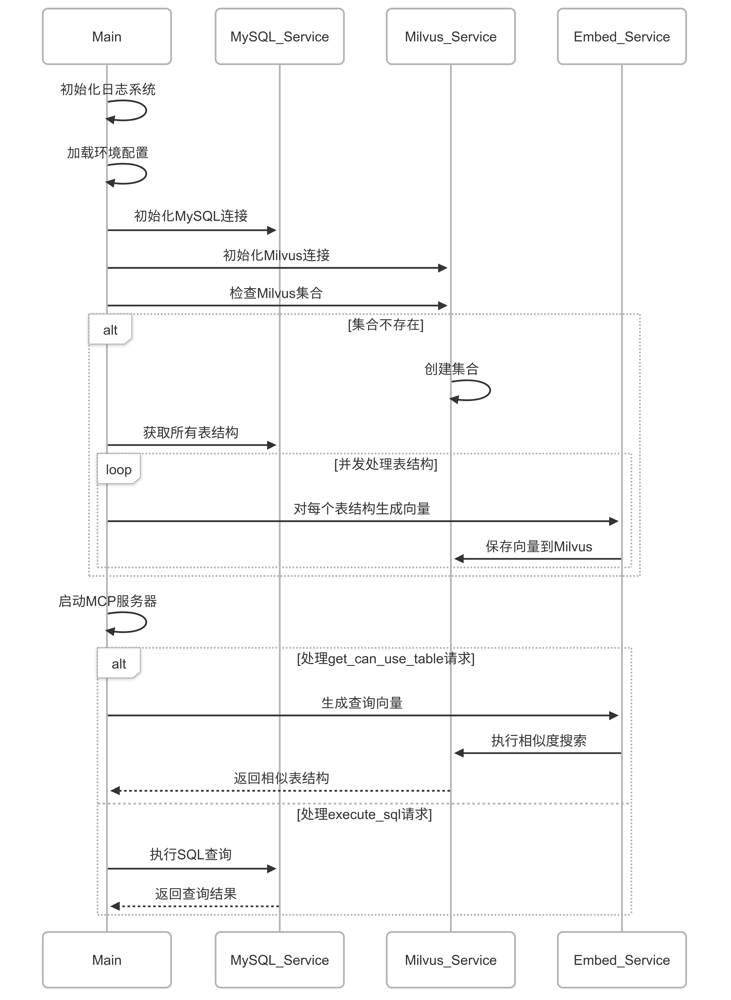

# MySQL MCP 项目

该项目是一个 Mysql 的 MCP Server，提供对MySQL数据库的访问。结合了传统关系型数据库(MySQL)和向量数据库(Milvus)的优势，实现了以下核心功能：
1. 数据库schemas查询 ：允许LLMs通过自然语言查询获取相关表结构信息
2. SQL查询执行 ：支持执行SQL语句并返回查询结果


## 流程图



## 环境配置

项目需要以下环境变量配置（在 `.env` 文件中设置）：

### MySQL 数据库配置
- `DB_USER`: 数据库用户名
- `DB_PASSWORD`: 数据库密码
- `DB_HOST`: 数据库主机地址
- `DB_PORT`: 数据库端口（默认 3306）
- `DB_NAME`: 数据库名称
- `DB_PARAMS`: 数据库连接参数（如字符集、时区等）

### SiliconFlow API 配置（用于向量嵌入）
- `SILICONFLOW_TOKEN`: SiliconFlow API 访问令牌
- `SILICONFLOW_URL`: SiliconFlow API 端点 URL

### Milvus 向量数据库配置
- `MILVUS_HOST`: Milvus 服务器地址
- `MILVUS_PORT`: Milvus 服务端口（默认 19530）
- `MILVUS_COLLECTION`: Milvus 集合名称

## 功能特性

- 表结构查询：通过 `get_can_use_table` 工具根据自然语言描述查找相关表结构
- 执行 SQL 查询：通过 `execute_sql` 工具执行 MySQL 数据库查询
- 向量相似度搜索：使用 Milvus 进行高效的向量相似度搜索
- 自动表结构索引：系统启动时自动获取所有表结构并创建向量索引

##  主要流程说明

1. **系统初始化**：加载环境配置、初始化日志系统、连接数据库
2. **向量数据库准备**：检查并创建 Milvus 集合，获取所有表结构并进行向量化处理
3. **请求处理**：
   - 表结构查询：将自然语言描述转换为向量，在 Milvus 中搜索相似表结构
   - SQL 查询：直接执行 SQL 语句并返回结果
  


## 使用方法

1. 确保 MySQL 和 Milvus 可正常访问
2. 打包应用程序：`go build -o yourPath/mcp-mysql`
3. 在`yourPath` 创建 `.env` 文件并配置相关环境变量
4. MCP 配置 
```json
 "mcpName": {
      "timeout": 60,
      "command": "yourPath/mcp-mysql",
      "args": [
        "-m",
        "query",
        ""
      ],
      "transportType": "stdio"
    }
   ```

## 依赖项

- Go 1.23+
- MySQL 数据库
- Milvus 向量数据库 v2.5+
- SiliconFlow API（用于生成文本嵌入向量）
- zap 日志库（用于结构化日志记录）

## 其他资料
* MCP 官方文档：https://modelcontextprotocol.io/introduction
* vscode 安装 cline 扩展(MCP host端)：https://docs.cline.bot/getting-started/installing-cline
* milvus 本地安装教程：https://milvus.io/docs/install_standalone-docker-compose.md
* 硅基流动注册、APIKEY 获取：https://docs.siliconflow.cn/cn/userguide/quickstart
