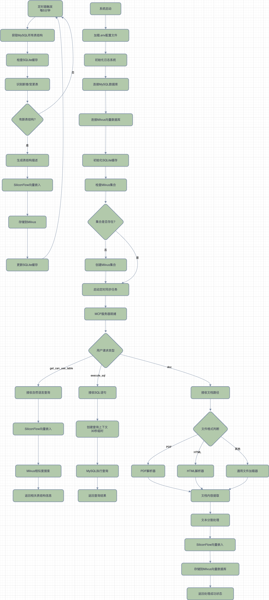
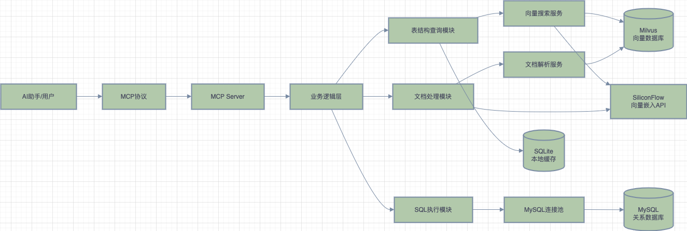
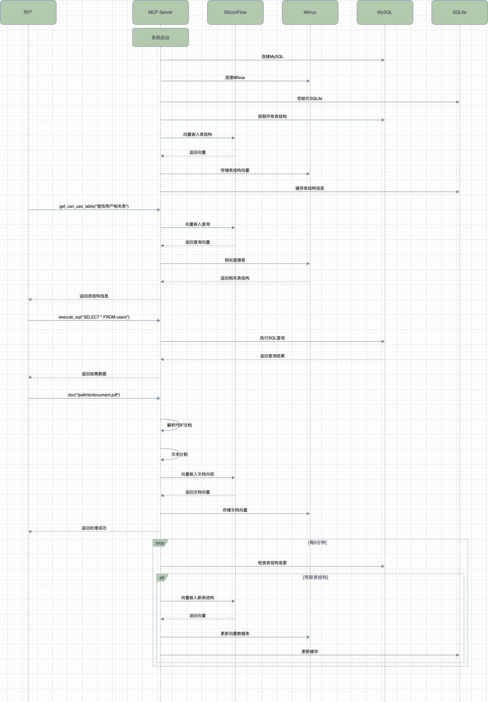

# MySQL MCP 项目

该项目是一个智能化的 MySQL MCP Server，结合了传统关系型数据库(MySQL)和向量数据库(Milvus)的优势，通过AI技术实现了数据库的智能查询和文档管理。项目提供以下核心功能：

1. **智能表结构查询**：通过自然语言描述自动查找相关数据库表结构
2. **SQL查询执行**：支持执行SQL语句并返回查询结果  
3. **文档智能处理**：支持多种格式文档上传、解析和向量化存储
4. **向量相似度搜索**：基于语义理解的智能内容检索
5. **自动化数据同步**：定时更新数据库表结构到向量数据库


## 流程图
系统流程图

技术架构图

数据流图



## 环境配置

项目需要以下环境变量配置（在 `.env` 文件中设置）：

### MySQL 数据库配置
- `DB_USER`: 数据库用户名
- `DB_PASSWORD`: 数据库密码
- `DB_HOST`: 数据库主机地址
- `DB_PORT`: 数据库端口（默认 3306）
- `DB_NAME`: 数据库名称
- `DB_PARAMS`: 数据库连接参数（如字符集、时区等）

### SiliconFlow API 配置（用于向量嵌入）
- `SILICONFLOW_TOKEN`: SiliconFlow API 访问令牌
- `SILICONFLOW_URL`: SiliconFlow API 端点 URL

### Milvus 向量数据库配置
- `MILVUS_HOST`: Milvus 服务器地址
- `MILVUS_PORT`: Milvus 服务端口（默认 19530）
- `MILVUS_COLLECTION`: Milvus 集合名称

## 功能特性

### 🔍 智能表结构查询
- **工具名称**: `get_can_use_table`
- **功能描述**: 根据自然语言描述智能查找相关表结构信息
- **技术实现**: 使用向量嵌入技术将查询转换为向量，在Milvus中进行相似度搜索
- **应用场景**: 在编写SQL前快速了解相关表结构

### 💾 SQL查询执行
- **工具名称**: `execute_sql`
- **功能描述**: 直接执行MySQL数据库查询并返回结果
- **安全特性**: 支持查询超时控制，防止长时间运行的查询
- **返回格式**: 结构化的查询结果数据

### 📄 智能文档处理
- **工具名称**: `doc`
- **功能描述**: 上传文档并自动向量化存储到Milvus
- **支持格式**: 
  - 文本文件 (.txt, .md 等)
  - PDF文档 (.pdf)
  - HTML文件 (.html)
  - 其他常见文档格式
- **处理流程**: 文档解析 → 内容分割 → 向量嵌入 → 存储到向量数据库

### 🤖 自动化数据同步
- **定时更新**: 每5分钟自动获取数据库表结构变更
- **增量同步**: 智能识别新增表结构，避免重复处理
- **向量化存储**: 自动将表结构信息转换为向量并存储

### 🔎 向量相似度搜索
- **高效检索**: 使用Milvus进行毫秒级向量相似度搜索
- **语义理解**: 基于AI嵌入模型理解查询语义
- **精确匹配**: 支持余弦相似度算法，提供精确的相关性排序

##  主要流程说明

### 1. 系统初始化流程
加载环境配置 → 初始化日志系统 → 连接MySQL数据库 → 连接Milvus向量数据库 → 初始化SQLite缓存

### 2. 向量数据库准备流程
检查Milvus集合 → 创建集合(如不存在) → 获取所有表结构 → 向量化处理 → 存储到向量数据库

### 3. 智能查询流程
自然语言输入 → 向量嵌入 → Milvus相似度搜索 → 返回相关表结构 → 用户编写SQL → 执行查询 → 返回结果

### 4. 文档处理流程
文档上传 → 格式识别 → 内容解析 → 文本分割 → 向量嵌入 → 存储到Milvus → 返回处理状态


## 使用方法

### 环境准备
1. 确保 MySQL 数据库可正常访问
2. 确保 Milvus 向量数据库运行正常
3. 获取 SiliconFlow API 访问令牌

### 部署步骤
1. **编译应用程序**：
   ```bash
   go build -o yourPath/mcp-mysql
2. 配置环境变量 ：在 yourPath 创建 .env 文件并配置相关环境变量
3. MCP 客户端配置 ：
```json
"mcpName": {
  "timeout": 60,
  "command": "yourPath/mcp-mysql",
  "args": [
    "-m",
    "query",
    ""
  ],
  "transportType": "stdio"
}
```

## 技术架构
### 核心组件
- MySQL : 主数据存储
- Milvus : 向量数据库，存储嵌入向量
- SiliconFlow : AI嵌入服务，提供文本向量化
- SQLite : 本地存储
- Go : 主要开发语言
- MCP协议 : 通信协议
### 关键技术
- 向量嵌入 : 使用先进的AI模型将文本转换为高维向量
- 相似度搜索 : 基于余弦相似度的快速检索算法
- 文档解析 : 支持多种格式的智能文档处理


## 依赖项

- Go 1.23+
- MySQL 数据库
- Milvus 向量数据库 v2.5+
- SiliconFlow API（用于生成文本嵌入向量）
- zap 日志库（用于结构化日志记录）

## 其他资料
* MCP 官方文档：https://modelcontextprotocol.io/introduction
* vscode 安装 cline 扩展(MCP host端)：https://docs.cline.bot/getting-started/installing-cline
* milvus 本地安装教程：https://milvus.io/docs/install_standalone-docker-compose.md
* 硅基流动注册、APIKEY 获取：https://docs.siliconflow.cn/cn/userguide/quickstart
